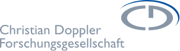
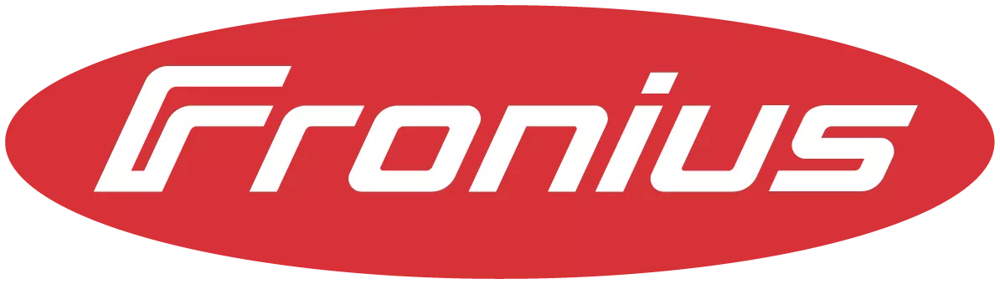

# Edgeist

A framework for deploying and continuously training neural networks on resource-limited devices.

This work was carried out with our partner companies as part of the Josef Ressel Centre for Artificial Intelligence for Resource-Constrained Devices. We would like to express our gratitude for the financial support provided by the Federal Ministry of Labour and Economy, the National Foundation for Research, Technology and Development, and the Christian Doppler Research Association.

## Partners
<table style="margin-left: auto; margin-right: auto">
  <tbody>
    <tr>
      <td>
        <a href="https://www.cdg.ac.at/">
          
        </a>
      </td>
    </tr>
    <tr>
      <td>
        <a href="https://www.danube-dynamics.at/">
          
        </a>
      </td>
    </tr>
    <tr>
      <td>
        <a href="https://www.fronius.com/">
          
        </a>
      </td>
    </tr>
  </tbody>
</table>

## Structure

The repository is split into the framework itself, examples and its tooling.

The framework is written in C++ and its source code can be found in [desktop_application](desktop_application).
Examples can be found in both [desktop_application](desktop_application) and [examples](examples). 
They are written in C++ as well.
> The code of the framework is currently bundled with the example in [desktop_application](desktop_application).
> 
> The framework will be refactored into its own linkable library at a later point.
> [desktop_application](desktop_application) will then be moved to [examples](examples).

The tooling is written in Python and can be found in [nmcm](nmcm).
Its main purpose is to autogenerate files required for the framework. 

## Development

### Devcontainer

The project is set up with a devcontainer.
Open the [Visual Studio Code](https://code.visualstudio.com/)
-Workspace([edgeist.code-workspace](edgeist.code-workspace)) via: `code edgeist.code-workspace`.

Install the [Dev Containers](https://marketplace.visualstudio.com/items?itemName=ms-vscode-remote.remote-containers)
-extensions from the `Visual Studio Code`-marketplace, then press `F1` and type
`Dev Containers: Rebuild and Reopen in Container`. After pressing `Enter`, the project will load in the devcontainer.

The devcontainer contains everything required to further develop and debug this project.
This includes compilers, embedded debuggers and a fully set-up `venv`.
However, `Visual Studio Code` might not always respect the `venv` as `defaultInterpreter`.
Thus, if packages are missing, first check whether `Visual Studio Code` actually uses the `venv`.

### Debugging and Running Projects

Each project can be debugged by clicking `Start Debugging (F5)` within the `Run and Debug`-menu of `Visual Studio Code`.

### Contributing

Each C++-project enforces the code-style laid out in the `.clang-format` and `.clang-tidy` files.
These are based on the `WebKit`-style and enforce strict lints.
Documentation is required, must conform to and is generated via [Doxygen](https://www.doxygen.nl/).

Likewise, each Python-project enforces the code-style laid out in their `pyproject.toml`.
The style is based on PEP-recommendations, but slightly altered in parts.
Documentation is required, must conform to and is generated with [Sphinx](https://www.sphinx-doc.org/en/master/).

Commits must follow the rules of [Conventional Commits](https://www.conventionalcommits.org/en/v1.0.0/).

[Gitflow](https://www.atlassian.com/git/tutorials/comparing-workflows/gitflow-workflow) is used.

## Build Instructions

### C++-Projects

This project contains a number of C++-projects:

* [desktop-application](desktop_application)
* [stm32-h563zi](examples/stm32-h563zi)
* [STM32F413](examples/legacy/MC-Code/STM32F413) (legacy)
* [STM32H7A3](examples/legacy/MC-Code/STM32H7A3) (legacy)

All but the legacy projects are [CMake](https://cmake.org/)-based.
Each has its own standalone `CMakeLists.txt`.

`CMake`-projects can be built using the [build_cpp.sh](scripts/build_cpp.sh)-script.
The `build_cpp.sh` has a single argument:
The path to the directory containing the given projects `CMakeLists.txt`:

```bash
./build_cpp.sh /path/to/cmake/lists/
```

This creates a binary.
The binary can be run on the host, or, in case of the STM32-examples, flashed and run on an STM32-microcontroller.

> Before being able to build `desktop-application`,`mncm_parser` must be run.
> This generates the required files, which must be copied to [generated](desktop_application/generated):
> * model_enums.h
> * model_structs.h
> * model_types.h

### Python-Projects

This project contains a number of python projects:

* [nmcm_checker](nmcm/checker)
* [nmcm_common](nmcm/checker)
* [nmcm_generator](nmcm/generator)
* [nmcm_packer](nmcm/packer)
* [nmcm_parser](nmcm/parser)
* [legacy tests](examples/legacy/MC-Code/Tests)

All projects but `legacy tests` are set up with a `pyproject.toml`.
Each of those projects with a `pyproject.toml` can be built by following these steps:

* Change directory to the one containing the given `pyproject.toml`
* Run `python -m build -n`

This creates an installable wheel.

> All projects but `legacy tests` and `nmcm_packer` depend on `nmcm_common`.
